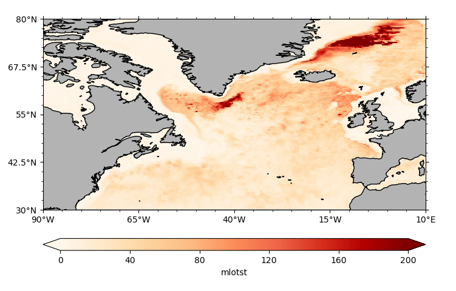

[[TOC]]

  
Parameters

bbla science stuff I know
lalala
mooncake is the best

# cli

## Introduction

Here is a simple example show how togenerator a markdown file with python scripts
## mlotst_month01_climitalogy
  

## mlotst_month01_Standard Deviation
  
